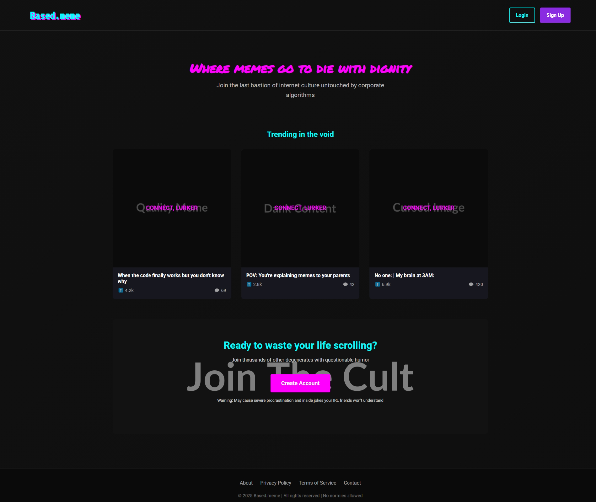

# Based.meme

## Dependencies

- [Google Fonts](https://fonts.google.com)

## Inspiration

- [4chan](https://www.4chan.org)
- [Instagram](https://www.instagram.com)
- [Reddit](https://www.reddit.com)
- [X](https://x.com)

## Tools

- [Docker](https://hub.docker.com/r/kotleta4/based-dot-meme/tags)
- [namecheap](https://www.namecheap.com)
- [Cloudflare](https://dash.cloudflare.com/login)
- [DigitalOcean](https://cloud.digitalocean.com/login)

## License

This project is licensed under the MIT License. See the [LICENSE](LICENSE) file for details.
